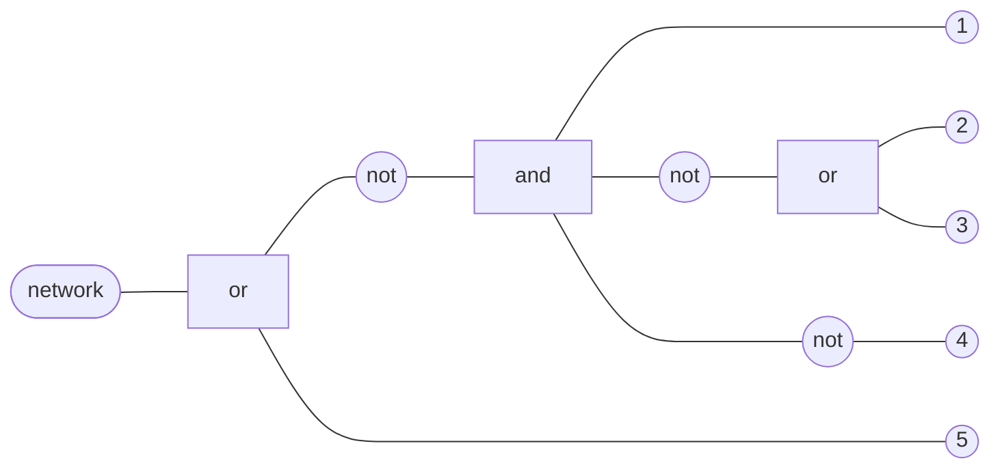

# logic


```mermaid
graph LR
    and ----- in1((1))
    and[and] --- not2((not)) --- or2[or] --- in2((2)) & in3((3))
    and ---- not1((not)) --- in4((4))
    not3((not)) --- and
    out([network]) --- or[or] --- not3
    or ------- in5((5))
```

```haskell
network = Or [Not (And [In, Not (Or [In, In]), Not In]), In]
```
